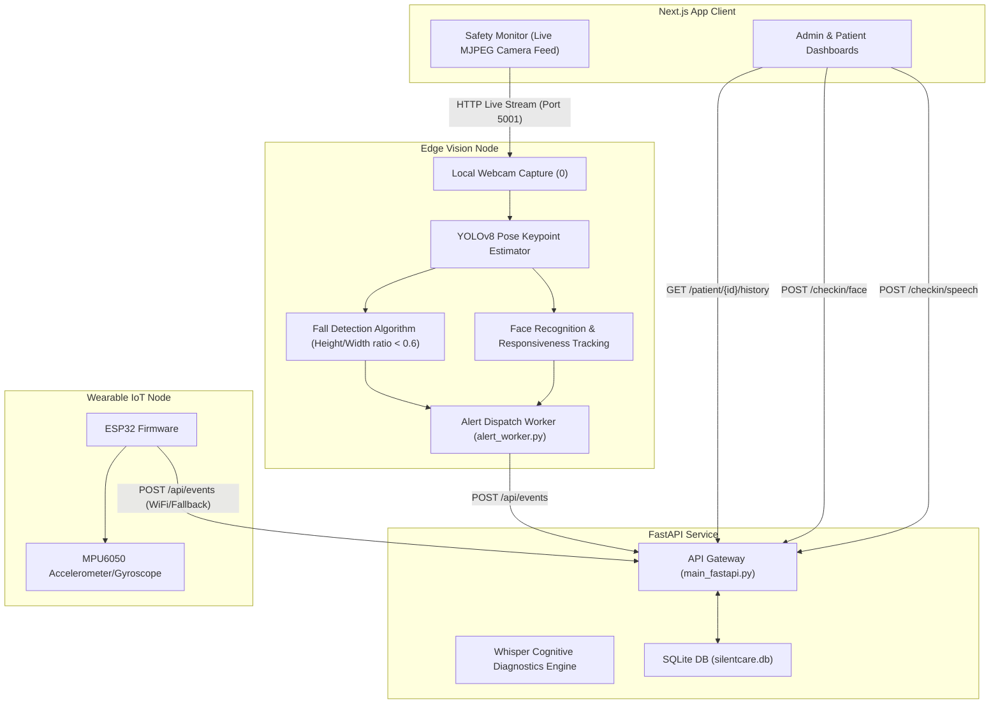

# SilentCare AI 🚀
### AI-Powered Early Emergency Detection & Response System

SilentCare AI is an intelligent ambient assisted living and safety monitoring platform designed for elderly care. The system integrates real-time computer vision (YOLOv8 Pose tracking), advanced speech phenotyping (Whisper-based slurring & cognitive diagnostics), wearable IoT fallback integration, and a unified medical monitoring dashboard.

---

## 📸 Architecture Overview

The following diagram illustrates how the frontend, backend database, localized camera stream (vision node), and wearable IoT interact to deliver real-time patient assessments:



---

## ✨ Features

- **Ambient Fall Detection**: Continuous YOLOv8-pose keypoint tracking evaluates height-to-width geometry in real-time, dispatching critical safety alerts without requiring active patient interaction.
- **Biometric Face Verification & Responsiveness**: Authenticates patients during morning check-ins and tracks head rotation/unresponsiveness states.
- **Speech Phenotyping**: Transcribes speech check-ins using Whisper, calculating Words Per Minute (WPM), hesitation counts, and vocabulary richness index to detect signs of slurring or cognitive decline.
- **Unified Live Monitoring & Alerts**: Live dashboard for caregivers featuring automatic refresh, alert dispatching/resolution state tracking, and historical trend analytics.
- **Hardware Integration**: Fallback ESP32 + MPU6050 firmware for physical wearable fall tracking.

---

## 📂 Repository Structure

```
├── frontend/             # Next.js 15+ (React) web application (Tailwind CSS, Recharts)
├── backend/              # FastAPI server (SQLAlchemy, SQLite, OpenCV, Ultralytics YOLO, Whisper)
├── vision_node/          # Localized Python camera streaming node (YOLOv8 Pose, Flask MJPEG server)
├── wearable_firmware/    # ESP32 C++ firmware for MPU6050 hardware sensors
└── docs/                 # System documentation & reference manuals
```

---

## 🛠️ Installation Steps

### 1. Prerequisites
- **Node.js**: v18+
- **Python**: v3.10+
- **Webcam**: Connected to your device (index 0)

### 2. Backend Setup
1. Navigate to the backend directory:
   ```bash
   cd backend
   ```
2. Create and activate a virtual environment:
   ```bash
   python -m venv venv
   source venv/bin/activate  # On Windows: venv\Scripts\activate
   ```
3. Install dependencies:
   ```bash
   pip install -r requirements.txt
   ```
4. Start the backend:
   ```bash
   python -m uvicorn main_fastapi:app --host 0.0.0.0 --port 8000
   ```

### 3. Frontend Setup
1. Navigate to the frontend directory:
   ```bash
   cd ../frontend
   ```
2. Install dependencies:
   ```bash
   npm install
   ```
3. Set environment variables:
   Create `.env.local`:
   ```env
   NEXT_PUBLIC_API_URL=http://localhost:8000
   ```
4. Start the frontend:
   ```bash
   npm run dev
   ```

### 4. Vision Node Setup
1. Navigate to the vision node directory:
   ```bash
   cd ../vision_node
   ```
2. Install python dependencies:
   ```bash
   pip install opencv-python ultralytics flask requests
   ```
3. Start the streamer:
   ```bash
   python camera_streamer.py
   ```

---

## 🚀 Deployment Steps

### Frontend (Vercel)
1. Push your repository to GitHub.
2. Sign in to [Vercel](https://vercel.com) and click **Add New Project**.
3. Import the `SilentCareAI` repository.
4. Set the **Root Directory** to `frontend`.
5. Configure the Build settings:
   - Framework Preset: **Next.js**
   - Build Command: `next build`
   - Install Command: `npm install`
6. Add the environment variable:
   - Name: `NEXT_PUBLIC_API_URL`
   - Value: `[YOUR_DEPLOYED_BACKEND_URL]` (e.g. `https://silentcare-backend.onrender.com`)
7. Click **Deploy**.

### Backend (Render / Railway)
1. Create a new Web Service on Render or Railway, connecting it to your GitHub repository.
2. Set the **Root Directory** to `backend`.
3. Set the Environment/Language to **Docker** (Render will automatically detect the `Dockerfile` in the root/backend folder).
4. Configure Environment Variables:
   - `PORT`: `8000`
5. The container will automatically:
   - Pull the lightweight Python 3.11 base image.
   - Install system libraries for OpenCV and FFmpeg (`libsndfile1`, `ffmpeg`).
   - Run the FastAPI application using the start command defined in the Dockerfile.

---

## 👥 Team Testing Guide

To test the system end-to-end, follow these simple steps:

1. **Access Web App**: Open the public Vercel frontend URL provided.
2. **Register a Patient**:
   - Go to the registration page (`/register`).
   - Add a patient name, age, caregiver details, and submit.
   - The system automatically generates a unique Patient ID (e.g., `PAT-0001`). Note down this ID!
3. **Login**:
   - Go to the login page (`/login`).
   - Choose the "Patient" role, enter your Patient ID, and log in.
4. **Speech Check-In**:
   - Navigate to `/patient/checkin`.
   - Complete the camera face check-in.
   - Record a 5-second speech snippet reading the morning prompt (e.g. "The weather is sunny and I feel fantastic").
   - Click stop to process the Whisper assessment.
5. **View Dashboard**:
   - Access the caregiver dashboard at `/admin/dashboard` or patient trends dashboard at `/patient/[id]/dashboard`.
   - Observe real-time speech WPM, slurring/vocabulary indicators, and face verification timestamps.
6. **Live Camera Monitor**:
   - Start the local `vision_node/camera_streamer.py` script.
   - Stand or move in front of your camera. Tilt your body sideways to trigger a fall or look away to test responsiveness.
   - Observe the live alert triggers popping up instantly on the admin safety monitor.